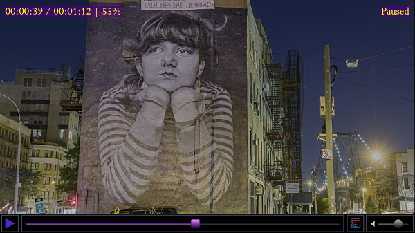
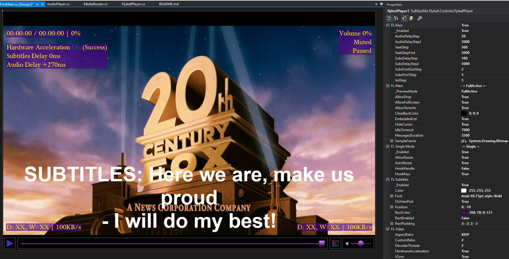
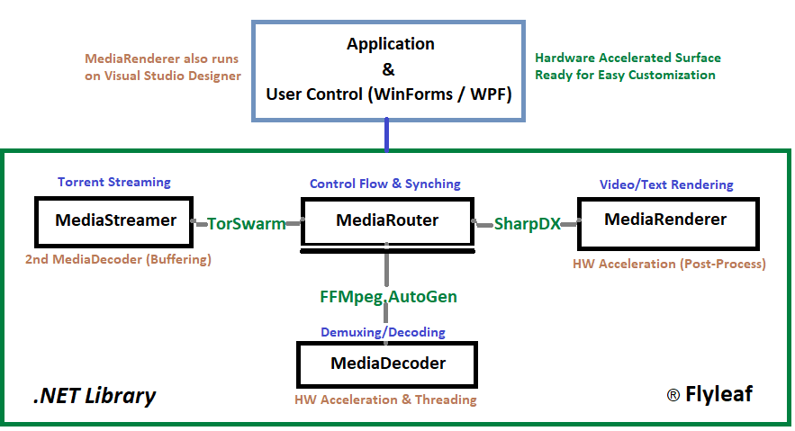

# Media Player, Web & Torrent Streamer Application [Open Library & Control for WinForms / WPF]
 

## Flyleaf Application
Flyleaf is a light Media Player & Torrent Streamer which supports 4K/HD resolutions, large number of video formats, protocols & torrent streaming.
The main concept is to be simple, accurate, fast & run smoothly by using as less resources as possible.

You open any video/subtitles file, youtube video or any web video (MediaSource object), url/link (all additional protocols that ffmpeg suppoort) or torrent (.torrent file or magnet link) by Drag & Drop, Copy & Paste or key O. It provides you a bar with the basic actions (Play/Pause/Seek/Mute/Volume) and includes a list with the torrent file contents. Currently for more functionality (such as Subtitles Position & Size) you can use the keyboard binding :-

| Keys                  | Action                     |
| :-------------:       |:-------------:             |
| O / Drag & Drop       | Open                       |
| Ctrl + V / Paste      | Open                       |
| P / Space             | Pause / Play               |
| Left / Right Arrows   | Seeking                    |
| A                     | Enable / Disable Audio     |
| S                     | Enable / Disable Subtitles |
| R                     | Keep Ratio                 |
| F                     | Full Screen / Normal Screen|
| H                     | Video Acceleration (On/Off)|
| I                     | Force Idle Mode            |
| Escape                | Back to Torrent File List  |
| Up / Down Arrows      | Volume Adjustment          |
| [ / ]                 | Audio Adjustment           |
| Ctrl + [ / ]          | Audio Adjustment 2         |
| ; / '                 | Subtitles Adjustment       |
| Ctrl + ; / '          | Subtitles Adjustment 2     |
| Ctrl + Up / Down      | Subtitles Location (Height)|
| Ctrl + Left / Right   | Subtitles Font Size        |

 

## Flyleaf UserControl

Wouldn't be great to have your own media hardware accelerated surface (Texture2D) served directly on your .NET WinForms / WPF IDE ready for your personal customization?

That's why the 2nd version of MediaRouter "Flyleaf" came for! To provide you smooth video & text rendering (Direct3D/2D & DirectWrite) on a customizable surface. It runs even during IDE's designer and you can see live the changes that you have performed.

Flyleaf's properties all start with "FL" letters and allows you to configure both the UI Layout (Fonts, Positions, Sizing, Coloring etc.) & Player's Configuration (VSync, HW Acceleration, Threading etc.)

To add the control to your application, download the latest release (unzip it), right click to your Toolbox -> Choose Items... & Browse to the Libs directory and choose Flyleaf.dll file. You should be able to see FlyleafPlayer now.

Flyleaf runs also during Visual Studio Designer

 

## Flyleaf Design

### Layer 1.1 - Multimedia Framework (MediaDecoder.cs)

> <a href="https://www.ffmpeg.org">FFmpeg</a> 4.3 library (implemented with C# bindings <a href="https://github.com/Ruslan-B/FFmpeg.AutoGen">FFmpeg.AutoGen</a> 4.3)

Demuxes the input file and configures the included media streams. It creates one thread per media stream for decoding. Additionally, it supports hardware acceleration decoding (FFmpeg embedded), threading and accurate seeking by decoding from the previous key/I frame until the requested (in case of B/P frames).

### Layer 1.2 - Media Streaming (MediaStreamer.cs)

> <a href="https://github.com/SuRGeoNix/TorSwarm">TorSwarm</a> library (for Torrent Streaming)

Creates a 2nd decoder with a custom AVIO Context that runs towards on 1st decoder to buffer the streamed data before actually process them.

### Layer 2.0 - Media Router (MediaRouter.cs)

The purpose of Media Router is to be a "mediator" between a frontend GUI Audio / Video player and a backend Multimedia Framework. It will be responsible to satisfy frontend's needs such as Open/Play/Pause/Seek/Stop functionalities but also to serve __accurate__ with the right __control flow__ and __synchronized__ the requested media frames such as Audio, Video and Subtitles.

__Accurate__ &nbsp;&nbsp;&nbsp;&nbsp;&nbsp;&nbsp;&nbsp;&nbsp;: Media frames will be served at the exact timestamp that they supposed to.

__Control Flow__ &nbsp;: The incoming flow from Multimedia Framework and outgoing to GUI will be kept low (CPU/GPU/RAM).

__Synchronized__ : Ensures that all time the served media frames will be synchronized between them.

The main implementation is within "Screamers" methods that route media frames accurately (based on frame timestamp) to the frontend. It supports Audio and Subtitles synchronization with the Video frames. Additionally, it tries to keep the frame queues low so the backend decoder will run only when required (to keep CPU/GPU/RAM low).

### Layer 3.1 - User Interface (MediaRenderer.cs)

> <a href="http://sharpdx.org">SharpDX</a> 4.2 library for Direct3D / Direct2D / DirectWrite Interops

Post-processes the incoming - from MediaDecoder - Video Frames (HW Accelerated NV12, P010 - or not YUV420P, sws_scale for rest) and converts them to RGBA to present them. It is also responsible for (OSD) Text Rendering (required for incoming Messages eg. VolumeChanged/PlayerStatusChanged/SubsPositionChanged) that they are assigned to specific Surfaces (positions).

### Layer 3.2 - User Interface Control (FlyleafPlayer.cs)

Exposes the whole library's functionality with an easy way to the front-end. Collects all the main configuration and functionality for all the classes in to one class and contains useful (On/Off) embedded functionality to save front-ends work (Non-borders Form Resizing/Auto Resize Form based on aspect ratio etc.)

 

## Requirements

The whole implementation is targeting and should be able to run on any Windows Platform (DirectX) and .NET Framework. However it's not tested enough yet and you might have some issues with the UserControl for WPF (issues with ParentForm and Handles).

FFmpeg libraries (Windows builds) are required and should be placed under Libs\\\<platform>\\FFmpeg directory - where \<platform> = x86 or x64 - from the current application's (.exe) directory (or any below it, check MediaDecoder.cs -> RegisterFFmpegBinaries() for more details).

Plugins (currently "Torrent Streaming" & "Web Streaming") should exist under "Plugins" directory if you want to enable them.

It seems there is a bug with System.Buffers assemblies therefore it is required for TorSwarm (Torrent Streaming) to add the below bindings (App.Config) to your application (such as this <a href="https://github.com/SuRGeoNix/Flyleaf/blob/master/Flyleaf%20Player%20(WinForms%20Demo%201)/App.config">one</a>)

Ensure that you use Restore NuGet Packages to retrieve all the rest required libraries.

## Changelog

#### v2.1a - 12/10/2020
>__Additions__

* Re-design Flyleaf's Core (MediaRouter/MediaDecoder)
* Changing Multi Format Context to Single | faster opening, seeking, playing & streaming
* Changing Seek Acuratute (based on I/B/P) to Seek (based on I key frames) | faster seeking
* New efficient algorithms for Decoding & Syncing
* Adding support for Live Streaming (you might need to use larger queues for smooth streaming)
* Adding Buffering & Downloading percentages for Torrent Streaming
* Using larger Queues / Threads to enable full functionality (for weird formats, HD and Streaming) by default

>__Issues__

* Memory Leak with RGBA texture (coming from sws_scale)

#### v2.0a - 3/10/2020
>__Additions__

* Replaced doubled forms -to achieve transparency- with DirectWrite (OSD Surfaces & Messages)
* Replaced Monogame and heavy game-loop (rendering on-demand now) with SharpDX Interops for better performance
* Re-coding thread implementation and proper stopping instead of aborting them
* Replaced sws_scale (on most cases) with proper HW Acceleration Post-Processing (P010 VideoProcessorBlt, YUV420P with PixelShader etc.)
* Enabled decoder's threading & planning to expose also video queues Min/Max to achieve > 4K resolution cases.
* Implemented 'Seek on Slide' for smooth seeking (can be disabled on-demand)
* Added functionality to discard Audio / Subtitles streams (can be enabled back on-demand - keys A, S)
* Finally, implementing UserControl that take advantage of the library and exposes it's functionality (Multi-Players supported as well)
* 4K runs smoothly now!

>__Known Issues & Missing Functionality (Draft List)__

<u>Application</u>

* Floating menu, additional pop-form required for loading/changing/saving settings/configuration
* Current list for torrent files will not show folders/sizes etc. requires more work
* Subtitles button to enable/disable (even embedded) add custom subs (also plugin for opensubtitles) [default languages/priorities]
	
<u>UserControl</u>

* It cannot work as a "HookForm" on WPF so all embedded functionality that communicates with parent form will not work
* Allow to add new osd surfaces and more custom messages (different control such as label for easier use?)
* Review windows font -> sharpdx font (mainly for fontweight - bold)
* Fallback to common font family (arial) in case of error (avoid possible crashing issues)
	
<u>Library</u>

* High Resulotion (>1080p) requires more testing (should check decoder's threads/flags, router's queues and thread sleep after device context flush)
* Renderer, review post-process with more pixel shaders formats (is videoprocessorblt faster than pixelshaders? is it the same?)
* Streaming requires reviewing for both ffmpeg's and torswarm's configuration (timing parameters) and thread aborting
* Torrent streaming requires seeding & more protocols support (utp, hole-punching) also more efficient buffering
* Subtitles when external delay forces to go back will not auto-restart
* Audio player / Decoder requires more work to play other than 2 channels/48Khz (expose also to settings)
* Audio player for multi-players should be able to have different volume on each instance (review mute implementation as well)
* Decoder should check for possible more subs/audio language streams and let the UI decide

#### v1.2.6 and below <a href="https://github.com/SuRGeoNix/Flyleaf/tree/release-v1.2.6">here</a>

 

## Remarks
I have worked on this project for education, fun and programming exercise and I've made it available to the public in case you will find it useful for similar reasons. It's always fun as programmers to have our own media player and play around. Any suggestions are always welcome!