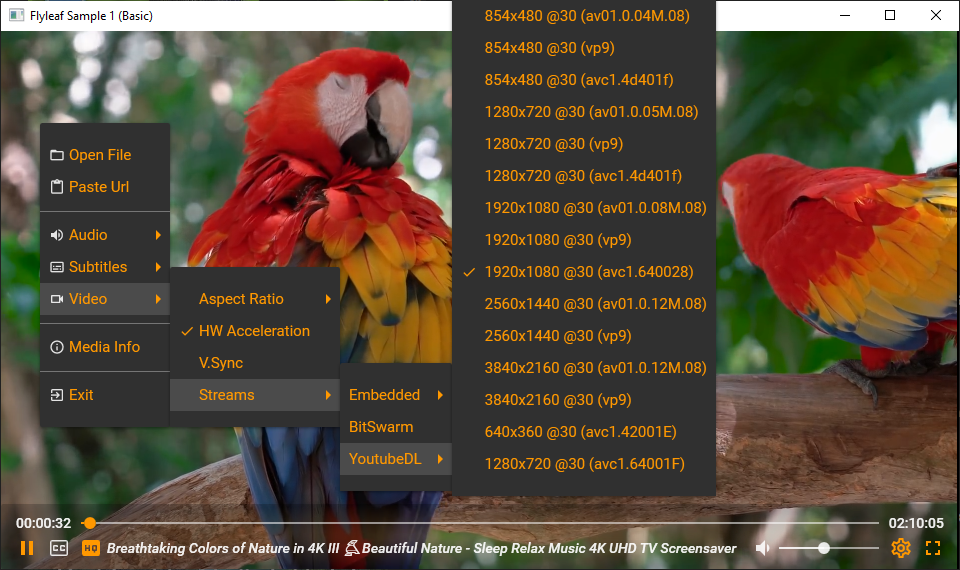

# *Flyleaf v3.0*: Video Player .NET Framework Library & WinForms/WPF Control

---

>Notes 
>Flyleaf v3.0 releases can be found on NuGet https://www.nuget.org/packages?q=flyleaf 
>You can find a pre-compiled sample version at https://github.com/SuRGeoNix/Flyleaf/releases/tag/v3.0-preview

### [Supported Features]
* ***Light***: for GPU/CPU/RAM as it supports video acceleration, post-processing with pixel shaders and it is coded from scratch
* ***High Performance***: threading implementation and efficient aborting/cancelation allows to achieve fast seeking
* ***Stable***: library which started as a hobby about 2 years ago and finally became a stable (enough) media engine
* ***Formats Support***: All formats and protocols that FFmpeg supports with the additional supported by plugins (currently torrent (bitswarm) / web (youtube-dl) streaming)
* ***Pluggable***: Focusing both on allowing custom inputs (such as a user defined stream) and support for 3rd party plugins (such as scrappers / channels / playlists etc.)
* ***Configurable***: Exposes low level parameters for customization (demuxing/buffering & decoding parameters)
* ***UI Controls***: Providing both "naked" and embedded functionality controls 

### [Missing Features]
* HDR support
* Video Capture / Record / Zoom / Post Process Filters (Brightness/Sharping etc.)
* Speed (Step/Fast Backwards/Forwards)
* Windows OS is required

### [Major changes from v2.6]
* Separating controls and plugins (*bitswarm, youtube-dl, opensubtitles*) from the library
* Recoding MediaRouter to support workflows for plugins (a base for later on to support scrappers etc.)
* Dropping OSD support from MediaRender and removing Direct2D rendering (was used mainly to achieve transparent overlay content which can be done now with WPF)
* Dropping WinForms embedded functionality support (at least for now, still supports "naked" control) and focusing on WPF/MVVM to achieve better graphics/effects/styles/themes/templates etc.
* Creating library's and WPF control's NuGet packages

### [Build Requirements]
* .NET Framework 4.7.2
* FFmpeg shared libraries (compatible with FFmpeg.Autogen)
* Use Utils.FFmpeg.RegisterFFmpeg(*ffmpeg_path*) to register them
* To use plugins put them in *Plugins/PluginName* folder
* Debugging with BitSwarm plugin should disable NullReference exceptions
* Don't run VS designer in x64
* If you are editing WPF flyleaf's template use style with StaticResource and not DynamicResource

### [Thanks to]
*Flyleaf wouldn't exist without them!*

* ***FFmpeg***
* ***FFmpeg.AutoGen***
* ***NAudio***
* ***SharpDX***
* Major open source media players ***VLC***, ***Kodi***, ***FFplay*** and for online subs ***OpenSubtitles***