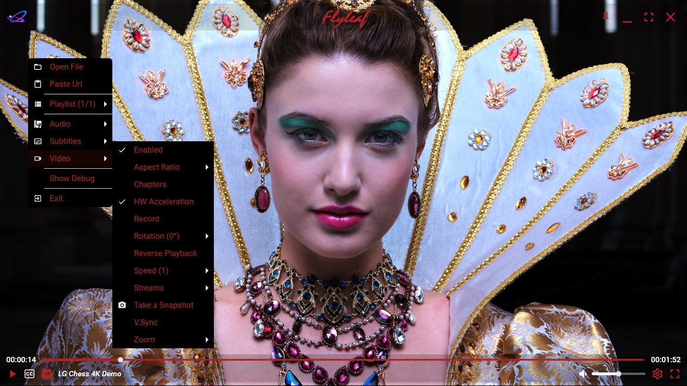

# *Flyleaf v3.9*: Media Player .NET Library for WinUI 3/WPF/WinForms (based on FFmpeg/DirectX)

---

>Notes 
>1. FlyleafLib's releases will be on [NuGet](https://www.nuget.org/packages?q=flyleaf)
>2. Compiled samples will be on [GitHub releases](https://github.com/SuRGeoNix/Flyleaf/releases)
>3. Documentation will be on [Wiki](https://github.com/SuRGeoNix/Flyleaf/wiki) and [Samples](https://github.com/SuRGeoNix/Flyleaf/tree/master/Samples) within the solution

# [Overview]

✅ **Play Everything** (Audio, Videos, Images, Playlists over any Protocol)

- *Extends FFmpeg's supported protocols and formats with additional plugins (YoutubeDL, TorrentBitSwarm)*
- *Accepts Custom I/O Streams and Plugins to handle non-standard protocols / formats*
	
✅ **Play it Smoothly** (Even with high resolutions 4K / HDR)

- *Coded from scratch to gain the best possible performance with FFmpeg & DirectX using video acceleration and custom pixel shaders*
- *Threading implementation with efficient cancellation which allows fast open, play, pause, stop, seek and stream switching*
	
✅ **Develop it Easy**

- *Provides a DPI aware, hardware accelerated Direct3D Surface (FlyleafHost) which can be hosted as normal control to your application and easily develop above it your own transparent overlay content*
- *All the implementation uses UI notifications (PropertyChanged / ObservableCollection etc.) so you can use it as a ViewModel directly*    
- *For WPF provides a Control (FlyleafME) with all the basic UI sub-controls (Bar, Settings, Popup menu) and can be customized with style / control template overrides*

# [Features]

### **FFmpeg**
- *HLS Live Seeking Might the 1st FFmpeg player which does that*
- *Pached for [HLS](https://patchwork.ffmpeg.org/project/ffmpeg/list/?series=1018) and [.NET](https://developercommunity.microsoft.com/t/Proper-handling-of-MS_VC_EXCEPTION-0x40/10961029) issues Use recommended FFmpeg libraries which can be found on GitHub releases*
- *Capture Devices Pass the format, input and options with a single Url eg. fmt://gdigrab?desktop&framerate=30*
- *Supports FFmpeg v7.1 and v8.0 (use Flyleaf.FFmpeg.Bindings v8 at your project)*

### **Playback**
- *Open / Play / Pause / Stop*
- *Speed / Reverse / Zero-Low Latency*
- *Seek Backward / Forward (Short / Large Step)*
- *Seek to Time / Seek to Frame / Seek to Chapter / Frame Stepping*

### **Video**
- *Enable / Disable*
- *Device Preference*
- *Aspect Ratio (Keep / Fill / Custom)*
- *Deinterlace (Supports double rate, D3D11VP only)*
- *HDR to SDR (Aces / Hable / Reinhard - FlyleafVP only)*
- *Pan Move / Zoom / Rotate / HFlip-VFlip / Cropping ~~(Replica Renderer/Interactive Zoom)~~*
- *Record / Snapshot*
- *Super Resolution (Nvidia / Intel - D3D11VP only)*
- *Video Acceleration*
- *Video Filters (Brightness / Contrast / Hue / Saturation)*
- *Video Processors (FlyleafVP / D3D11VP)*
- *VSync*
- *Zero-Copy (Crops with vertex shader)*

### **Audio**
- *Enable / Disable*
- *Device Preference*
- *Add / Remove Delay (Short / Large Step)*
- *Volume (Up / Down / Mute)*
- *Languages support System's default languages as priorities for audio streams*

### **Subtitles**
- *Enable / Disable*
- *Add / Remove Delay (Short / Large Step)*
- *Bitmap Subtitles support*
- *Advanced Character Detection and Convert to UTF-8 SubtitlesConverter plugin*
- *Languages support System's default languages as priorities for subtitles streams*

### **UI Control (FlyleafHost)** *WPF / WinUI &amp; WinForms (Partially)*
- *Attach / Detach*
- *Activity / Idle Mode*
- *Drag Move (Self / Owner)*
- *Drag & Drop Swap*
- *Drag & Drop Open*
- *Full / Normal Screen*
- *Resize / Resize & Keep Ratio*
- *Z-Order*

### **UI Control (FlyleafME)** *WPF Only*
- *Flyleaf Bar Control / Slider*
- *Flyleaf Popup Menu*
- *Flyleaf Settings Dialog*
- *Color Themes Based on Material Design in XAML*
- *Style / Control Template Customization*

### **Plugins**
- *OpenSubtitlesOrg Search & Download for online Subtitles*
- *SubtitlesConverter Detect & Convert the input's charset to UTF-8*
- *TorrentBitSwarm Play a media from torrent without the need to download it completely*
- *YoutubeDL Play web media that are not accessible directly with HTTP(s)*

### Misc.
- *Mouse & Key Bindings All the implementation supports customizable mouse & key bindings which can be assigned to an embedded or a custom actions (find defaults [here](https://github.com/SuRGeoNix/Flyleaf/wiki/Player-(Key-&-Mouse-Bindings)))*
- *Audio Player Can be used as an audio player only without the need of UI Control*
- *Downloader / Remuxer The library can be used also for downloading & remuxing*
- *Extractor The library can be used also for extracting video frames (supports also by X frames Step)*

# [Thanks to]

*Flyleaf wouldn't exist without them!*

* *For the Core*
  * ***[FFmpeg](http://ffmpeg.org/)*** / ***[FFmpeg.AutoGen](https://github.com/Ruslan-B/FFmpeg.AutoGen/)*** / ***[Flyleaf.FFmpeg.Bindings](https://github.com/SuRGeoNix/Flyleaf.FFmpeg.Generator)***
  * ***[Vortice](https://github.com/amerkoleci/Vortice.Windows)***
  * *Major open source media players* ***[VLC](https://github.com/videolan/vlc)***, ***[Kodi](https://github.com/xbmc/xbmc)***, ***[MPV](https://github.com/mpv-player/mpv)***, ***[MPC-BE](https://github.com/Aleksoid1978/MPC-BE)***, ***[FFplay](https://github.com/FFmpeg/FFmpeg/blob/master/fftools/ffplay.c)***

* *For the UI*
  * ***[Dragablz](https://github.com/ButchersBoy/Dragablz)***
  * ***[MaterialDesign Colors & Themes](https://github.com/MaterialDesignInXAML/MaterialDesignInXamlToolkit/)***

* *For the Plugins*
  * ***[BitSwarm](https://github.com/SuRGeoNix/BitSwarm)***
  * ***[OpenSubtitles.org](https://www.opensubtitles.org/)***
  * ***[YT-DLP](https://github.com/yt-dlp/yt-dlp)***