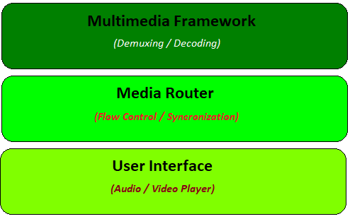
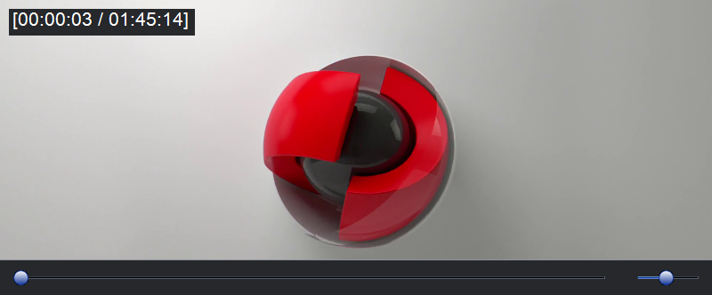

# Media Router

## Introduction
The purpose of Media Router is to be a "mediator" between a frontend GUI Audio / Video player and a backend Multimedia Framework. It will be responsible to satisfy frontend's needs such as Open/Play/Pause/Seek/Stop functionalities but also to serve __accurate__ with the right __control flow__ and __synchronized__ the requested media frames such as Audio, Video and Subtitles.

__Accurate__ &nbsp;&nbsp;&nbsp;&nbsp;&nbsp;&nbsp;&nbsp;&nbsp;: Media frames will be served at the exact timestamp that they supposed to.

__Control Flow__ &nbsp;: The incoming flow from Multimedia Framework and outgoing to GUI will be kept low (CPU/GPU/RAM).

__Synchronized__ : Ensures that all time the served media frames will be syncronized between them.

 

## Design

### Layer 1 - Multimedia Framework (FFmpeg.cs)

> <a href="https://www.ffmpeg.org/">FFmpeg 4.2.1</a> library (implemented with C# bindings <a href="https://github.com/Ruslan-B/FFmpeg.AutoGen">FFmpeg.AutoGen</a> 4.2.0)

Demuxes the input file and configures the included media streams. It creates one thread per media stream for decoding. Additionally, it supports hardware acceleration (partially) and accurate seeking by decoding from the previous key/I frame until the requested (in case of B/P frames).

### Layer 2 - Media Router (MediaRouter.cs)

The main implementation is within the "Screamer" method that routes media frames accurately (based on frame timestamp) to the frontend. It supports Audio and Subtitles synchronization with the Video frames. Additionally, it tries to keep the frame queues low so the backend decoder will run only when required (to keep CPU/GPU/RAM low).

### Layer 3 - User Interface (UserInterface.cs)

> <a href="http://www.monogame.net/">Monogame</a> 3.7.1 & <a href="https://github.com/naudio/NAudio">NAudio</a> 1.9.0 library & <a href="https://www.codeproject.com/Tips/1193311/Csharp-Slider-Trackbar-Control-using-Windows-Forms">ColorSlider</a>

A sample GUI has been created to demonstrate Media Router's functionality. It works with both Game Engine (for taking the advantage of GPU and Game Loop) and a classic Windows Form. For subtitles will work with BOM specified, UTF-8 formats otherwise with the default system codepage (lazy support for ASS/SSA). For audio it simple runs with the NAudio library. It currently supports :- 

| Keys                  | Action                    |
| :-------------:       |:-------------:            |
| Drag & Drop           | Open                      |
| P or Space            | Pause / Play              |
| S                     | Stop                      |
| R                     | Keep Ratio                |
| F or Escape           | Fullscreen                |
| Left / Right Arrows   | Seeking                   |
| Up / Down Arrows      | Volume Adjustment         |
| [ / ]                 | Audio Adjustment          |
| ; / '                 | Subtitles Adjustment      |

 

## Remarks
I have worked on this project for education, fun and programming exercise and I've made it available to the public in case you will find it useful for similar reasons. It's always fun as programmers to have our own media player and play around. Any suggestions are always welcome!

